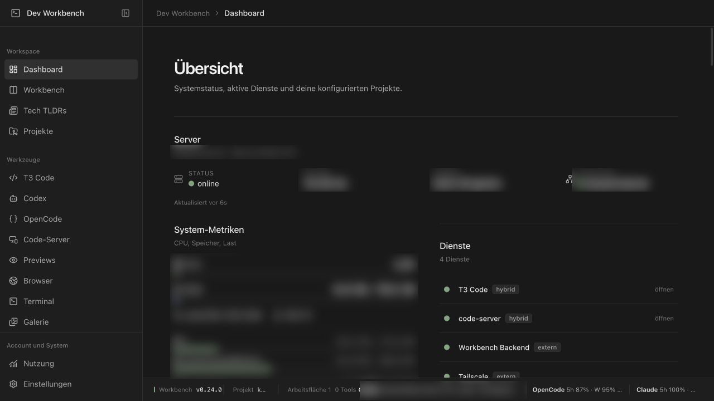
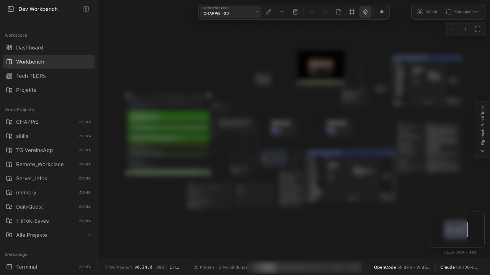
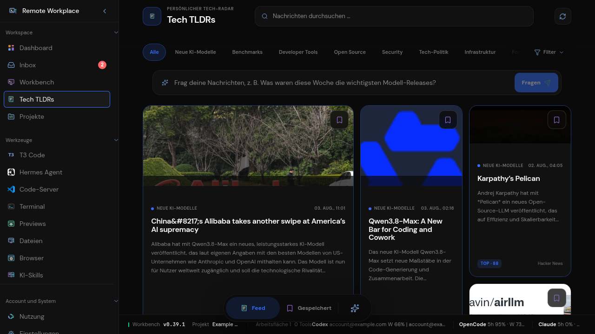
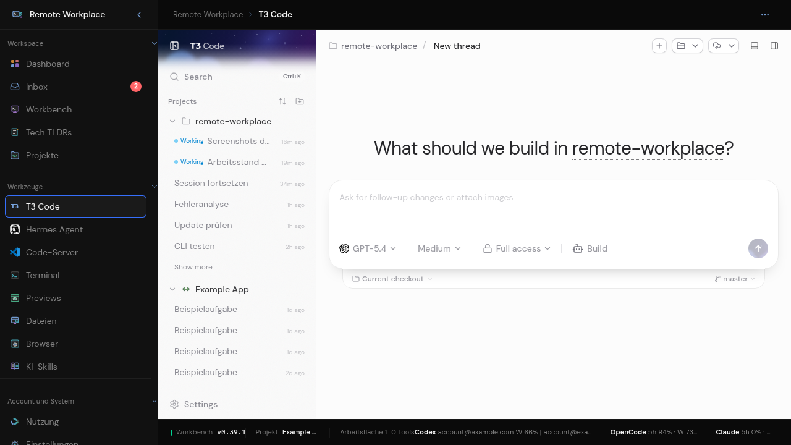
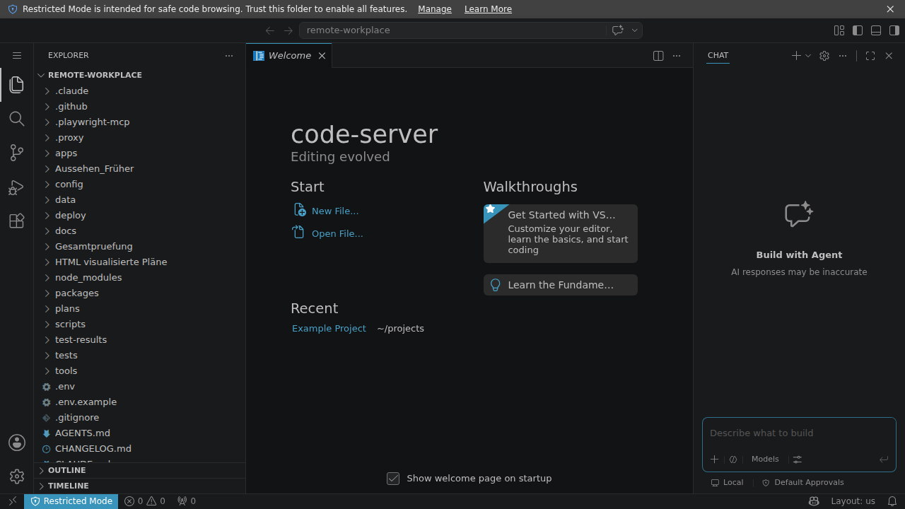
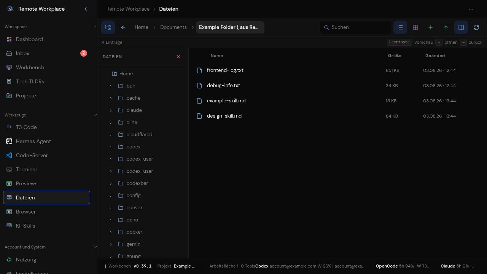
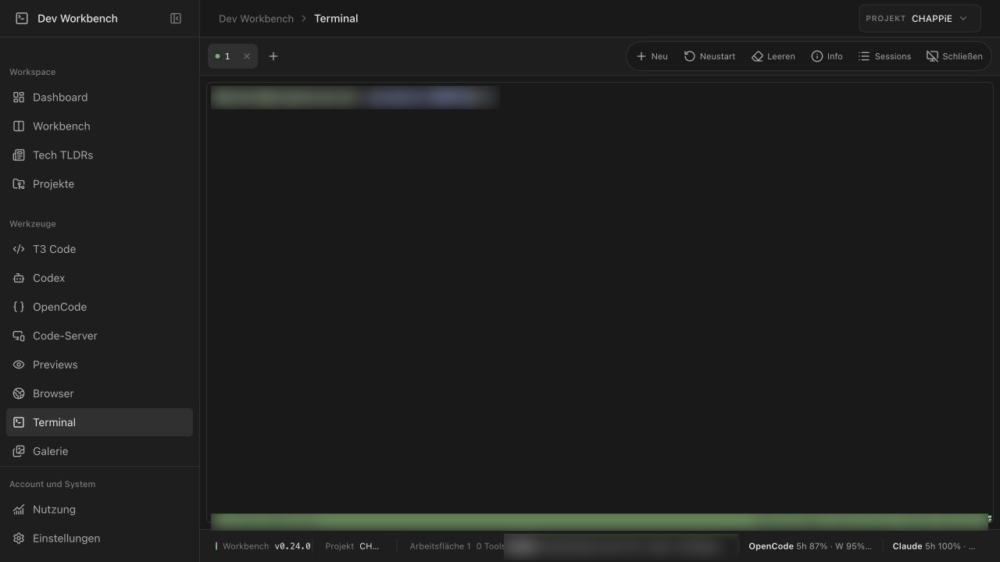
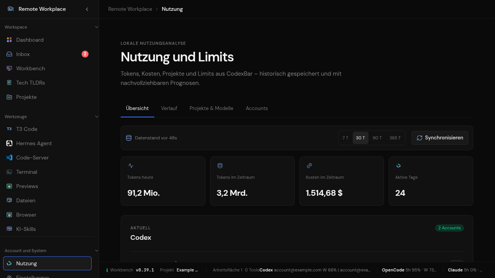
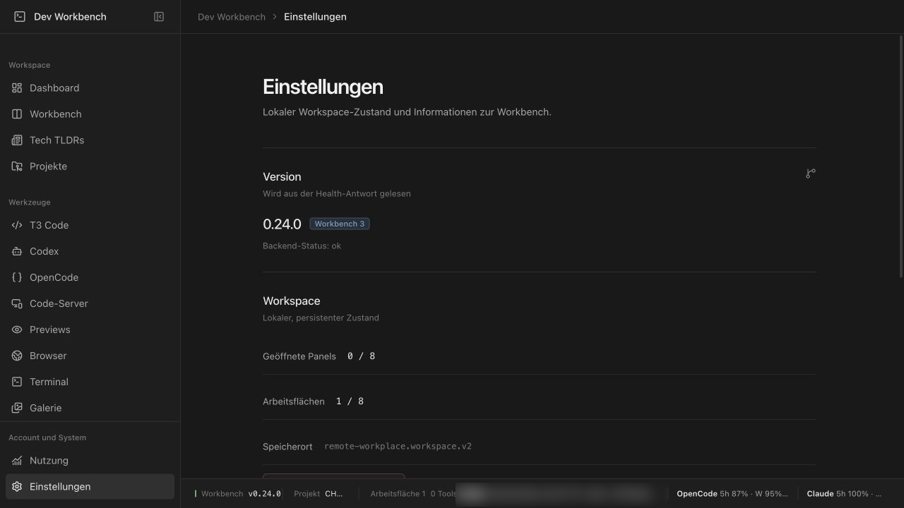

# Remote Workplace

Selbst gehostete Remote-Development-Workbench: ein privater Arbeitsplatz im Browser mit
Editor (code-server / T3 Code), nativen PTY-Terminals, KI-CLIs (Codex, OpenCode, Claude Code),
lokalen Projekten, Development-Previews, einem eingebetteten Browser, einem freien
Orbit-Workspace und einer Tech-News-Intelligence — alles auf deinem eigenen Server, privat
erreichbar über Tailscale.

> **Für wen?** Entwickler:innen, die von überall auf einen leistungsstarken, persönlichen
> Server-Arbeitsplatz zugreifen wollen, ohne Code oder Zugänge aus der Hand zu geben.

## Screenshots



<p align="center"><em>Dashboard: Systemstatus, aktive Dienste und konfigurierte Projekte auf einen Blick.</em></p>

| Development Workbench (Infinite Canvas) | Tech TLDRs – News Intelligence |
|:--:|:--:|
|  |  |
| Freier Orbit-Workspace mit Terminals, Agenten und Tools nebeneinander. | RSS-/HN-/YouTube-Feeds mit deutschen Zusammenfassungen und semantischer Suche. |

| T3 Code | code-server Editor |
|:--:|:--:|
|  |  |
| Agentengestützte Entwicklung direkt im Browser. | Vollwertiger VS-Code-Editor unter `/editor/`. |

| Medien- & Dateigalerie | Terminal |
|:--:|:--:|
|  |  |
| Bento-Mediengalerie und Dateiablage – hoch- und herunterladen von jedem Gerät. | Native `node-pty`-/xterm.js-Terminals mit Reconnect und Verlauf. |

| Nutzung & Limits | Einstellungen |
|:--:|:--:|
|  |  |
| Token-, Kosten- und Limithistorie für Codex, OpenCode und Claude Code. | Zentrale Konfiguration von Accounts, Diensten und Oberfläche. |

## Funktionen

- React-19-/Vite-Frontend und Fastify-5-Backend in einem strikten TypeScript-Monorepo.
- Tech TLDRs mit RSS-, Atom-, Hacker-News- und YouTube-Feed, deutschen Mistral-Zusammenfassungen, automatischer Wichtigkeit, semantischer Suche und quellengebundenen Rückfragen.
- Editorial-Bento auf Desktop sowie vertikaler Mobile-Snap-Feed mit Dynamic-Island-Wechsel zwischen Feed und benennbaren Sammlungen.
- Freier Orbit Workspace mit Zoom, Pan, Lasso, Mehrfachauswahl, adaptiv wachsendem Arbeitsgebiet und mehreren Canvas-Tabs.
- Mobile Orbit-Bedienung mit zuverlässigem Canvas-/Inhaltsmodus, Zwei-Finger-Pan und Pinch-Zoom, scrollbarer Steuerleiste sowie daumenfreundlichem Fünfer-Dock.
- Projekt-Hubs verbinden T3 Code, code-server, Preview, Browser, Notion, Terminal, Codex, OpenCode, Notizen, Snippets, Dateien und Nutzungsanzeigen visuell.
- Orbit-Zustand wird in einer updatefesten lokalen SQLite-Datei mit vollständiger Revisionshistorie gespeichert und automatisch synchronisiert.
- Jede erfolgreiche Orbit-Revision erhält zusätzlich eine unveränderliche, prüfsummengesicherte JSON-Sicherung außerhalb des Repositorys.
- Fehlende Datenbankstände werden automatisch wiederhergestellt; Konflikte und ungewöhnlich große Löschungen bleiben als getrennte Wiederherstellungsentwürfe erhalten.
- Sidebar-Palette und Slash-Menü erzeugen Knoten per Klick oder Drag-and-drop; Inspector, Szenen und Undo/Redo ermöglichen freie Organisation.
- Native `node-pty`-/xterm.js-Terminals mit Tailscale-Identität, tmux-Supervisor, serverseitiger Session-Registry, geräteübergreifender Wiederaufnahme, Resize, Verlauf und Reconnect.
- Eigenständige Codex- und OpenCode-Seiten mit automatisch gestarteten CLIs, Projektbindung und bis zu vier persistenten Bento-Instanzen je Werkzeug.
- Automatische Erkennung aller direkten, nicht versteckten Verzeichnisse unter dem konfigurierten Projekt-Root; Orbit sortiert die jüngste Auswahl aus Workbench-Nutzung, Dateisystemänderungen und Git-Commits und bietet zusätzlich eine vollständige Suche.
- Großer Orbit-Serverbrowser zeigt den vollständigen Dateibaum unter dem konfigurierten Home-Verzeichnis, springt direkt zu eingegebenen Pfaden und registriert beliebige Unterordner dauerhaft als Projekt-Hubs.
- code-server bleibt auf `127.0.0.1:8080` und wird samt WebSockets unter `/editor/` am privaten Workbench-HTTPS-Origin bereitgestellt.
- Development-Previews laufen direkt und ohne Bildstream über sechs getrennte HTTPS-Slot-Origins; Web Storage kann damit pro Rolle isoliert werden und Vite-HMR bleibt am Root erhalten.
- Benannte Orbit-Preview-Gruppen mit 1er-, 2er-, 3er- und 6er-Layout, Gerätepresets, Vollbildroute sowie lös- und andockbaren Slots.
- Ein eigener, serverseitig isolierter Chromium-Browser mit dauerhaften, benutzergebundenen Profilen erhält Cookies und Logins über Geräte- und Backendwechsel hinweg.
- Notion ist als gemeinsames Chromium-Werkzeug in Sidebar, Einzelansicht, Workbench und Infinite Canvas verfügbar; die Anmeldung bleibt ausschließlich im geschützten Serverprofil.
- Besuchte Hauptansichten, Iframes, xterm-Instanzen und WebSockets bleiben während der Browser-Session gemountet und wechseln ohne Neustart.
- Alle Live-Werkzeuge lassen sich frei positionieren und skalieren; stabile Laufzeit-IDs erhalten Terminal- und Agent-Sitzungen über Canvas-Interaktionen hinweg.
- Preview-Island mit Slot-Anzeige, Reload, externem Tab, Vollbild, iframe-/Chromium-Umschaltung, Geräteauswahl und Portrait-/Landscape-Wechsel.
- Lazy geladene Routen, Idle-Prefetch, Brotli/Gzip und langfristig gecachte Build-Assets reduzieren Start- und Wechselzeiten.
- Desktop-Sidebar, echte Breadcrumbs, mobile Gruppenansicht und Statuszeile mit Codex-, OpenCode- und Claude-Code-Limits.
- SQLite-gestützte Token-, Kosten-, Projekt- und Modellhistorie aus CodexBar mit Diagrammen und Limitprognosen.
- Sichere Codex-/OpenCode-/Claude-Code-Accountverwaltung mit lokaler Profilerkennung und isolierten CLI-Neuanmeldungen.
- **Schnellwechsel zwischen Accounts:** je Werkzeug genau ein serverweit aktiver Account — mehrere OpenAI-/Codex-Abos (privat, Arbeit) ebenso wie Claude Code und OpenCode. Ein Klick auf „Aktivieren“ oder `scripts/ki-account.sh use arbeit` schaltet um, ohne Abmeldung und ohne neue Geräteanmeldung; Projekte, Sessions und Konfiguration bleiben gemeinsam.
- Zod-validierte API, strenge CSP, loopback-only Dienste und Tailscale Serve ohne öffentlichen Funnel.
- Reproduzierbare systemd-Units mit Neustart, Healthchecks und Rollback-Vorbereitung.

## Voraussetzungen

- **Linux mit systemd** (für den dauerhaften Dienstbetrieb; zum Entwickeln reicht jedes System mit Node).
- **Node.js ≥ 22** und **pnpm 10**.
- **tmux** (für Terminal-Sessions), **Chromium/Chrome** (für das Browser-Tool).
- **Tailscale** für den privaten Remote-Zugriff — *optional*, lokal läuft es auch ohne.
- **code-server** (eingebetteter Editor), **CodexBar-CLI** (Nutzungshistorie), **Mistral-Account**
  (KI-Funktionen der Tech-TLDRs) — jeweils *optional*.

## Installation

### Empfohlen: Einrichtung durch einen Coding-Agent

Gib deinem Coding-Agent (Claude Code, Codex, OpenCode …) diesen Prompt:

```text
Lies und befolge docs/agent-setup.md in diesem Repository. Richte Remote Workplace auf
diesem Server ein: frag mich nach allen benötigten Werten (Systembenutzer, Projekt-Root,
Tailscale-Host/IP, erlaubte Login-E-Mails, optionale CLI-Pfade und Mistral-Key), erzeuge
config/workbench.local.json und .env aus den Vorlagen, führe scripts/install-deps.sh aus
und verifiziere am Ende den Health-Check.
```

Der Agent stellt die nötigen Fragen, füllt die Konfiguration, installiert alles und prüft,
dass die Workbench läuft. Details: [docs/agent-setup.md](docs/agent-setup.md).

### Manuelle Installation (Kurzform)

```bash
# 1. Konfiguration aus den Vorlagen erzeugen und mit echten Werten füllen
cp config/workbench.example.json config/workbench.local.json
cp .env.example .env
$EDITOR config/workbench.local.json   # Benutzer, Pfade, Tailscale, erlaubte E-Mails …
$EDITOR .env                          # optional: MISTRAL_API_KEY

# 2. Abhängigkeiten prüfen/installieren und bauen
bash scripts/install-deps.sh

# 3. Starten
pnpm dev                              # Entwicklung (Hot-Reload)
# oder für Produktion:
pnpm build && pnpm start
```

Health-Check: `curl -s http://127.0.0.1:3010/api/v1/health`

## Konfiguration

Alle persönlichen Werte leben in **einer** zentralen, gitignorierten Datei:
`config/workbench.local.json` (Vorlage: `config/workbench.example.json`). Sie bündelt Branding,
Systembenutzer, Tailscale-Angaben, alle Pfade und CLI-Pfade. Die `.env` enthält nur Secrets und
neutrale Runtime-Knöpfe; gesetzte Env-Variablen überschreiben einzelne Config-Werte.
Ausführlich: [docs/configuration.md](docs/configuration.md).

## Befehle

- `pnpm dev` – Contracts bauen und Server/Web parallel starten.
- `pnpm typecheck` – strict TypeScript prüfen.
- `pnpm lint` – Repository linten.
- `pnpm test` – Unit-/Integrationstests ausführen.
- `pnpm build` – Contracts, Server und Web produktiv bauen.
- `pnpm test:e2e` – Playwright-Abläufe prüfen.
- `pnpm start` – gebauten Produktionsserver auf localhost starten.
- `sudo bash deploy/systemd/install.sh` – systemd-Units aus der Config rendern und installieren.

## Dokumentation

- Architektur: [docs/architecture.md](docs/architecture.md)
- Installation: [docs/installation.md](docs/installation.md)
- Konfiguration: [docs/configuration.md](docs/configuration.md)
- Agent-Setup: [docs/agent-setup.md](docs/agent-setup.md)
- Terminal: [docs/terminal.md](docs/terminal.md)
- Fehlerbehebung: [docs/troubleshooting.md](docs/troubleshooting.md)
- Einbettungstest: [docs/embedding-test.md](docs/embedding-test.md)

## Danksagungen

Dieses Projekt baut auf großartigen Open-Source-Werkzeugen auf, die wir hier
integrieren und orchestrieren:

- **[T3 Code](https://github.com/pingdotgg/t3code)** von [Theo Brown (pingdotgg)](https://github.com/pingdotgg)
  — der agentengestützte Browser-Editor, der direkt in der Workbench läuft.
- **[code-server](https://github.com/coder/code-server)** — vollwertiger VS-Code-Editor im Browser.
- **[node-pty](https://github.com/microsoft/node-pty)** & **[xterm.js](https://github.com/xtermjs/xterm.js)** — native Terminal-Emulation.
- **[Tailscale](https://github.com/tailscale/tailscale)** — privater, sicherer Remote-Zugriff.

Ein besonderer Dank an Theo Brown und alle Mitwirkenden von T3 Code für das
offene, inspirierende Fundament, auf dem dieser Arbeitsplatz aufbaut.

## Lizenz

[MIT](LICENSE) © 2026 017pixel
